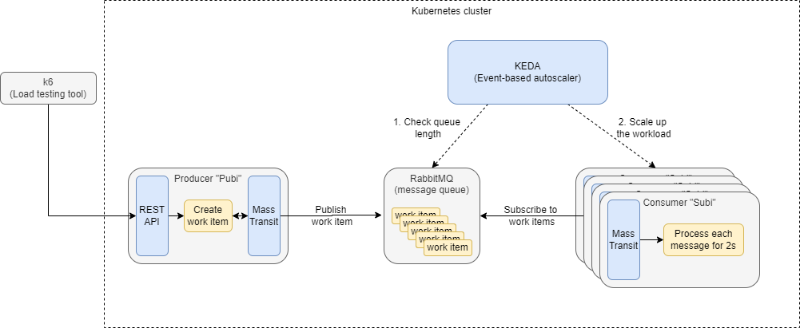

# Publish-Subscribe PoC 

## Overview

Some notable tools utilized in this PoC:

- k3s - Very lightweight Kubernetes distribution running in Docker
- .NET 6/7 Minimal APIs
- RabbitMQ - Message queue
- MassTransit - Abstraction for messaging with RabbitMQ
- KEDA - Kubernetes autoscaler
- k6 - Load testing tooling used to stress test the system



## Installation

1. Create the cluster:
    ```
    k3d registry create registry.local --port 0.0.0.0:5000
    k3d cluster create -c local-setup/k3d.config.yaml --registry-use k3d-registry.local:5000
    ```

2. Build the `pubi` and `subi` services:

    ```
    docker-compose build
    ```

3. Import the images from local Docker to the k3d cluster:

    ```
    k3d image import pubisubi-subi pubisubi-pubi -c local-k3s
    ```

4. Install rabbitmq operator (run 2x as CRDs are pre-requisite for install):
    ```
    kubectl apply -k ./local-setup/rabbitmq/
    ```
5. Deploy `pubi` and `subi` services:
    ```
    kubectl apply -f ./local-setup/subi/ -f ./local-setup/pubi/
    ```
6. Deploy KEDA autoscaler (run 2x as CRDs are pre-requisite for install):
    ```
    kubectl apply -k ./local-setup/keda/
    ```

## API Load Testing

```
docker run -it -v ${PWD}/k6/scripts:/scripts grafana/k6:latest run -u 100 -d 5s /scripts/work-script.js
```

## TODO

1. Run the setup to verify that it still works
2. Draw a diagram of the setup
3. Create a CI for Pubi and Subi services
    - Build the containers
    - Scan the containers for vulnerabilities using Trivy (Optional)
4. Use GitOps for deployment
    - Install FluxCD
    - Add Flux Kustomizations and regular Kustomizations
    - Build OCI artifact from manifests
5. Improve k6 load tests
    - Verify the request responses
    - Run as a Kubernetes job